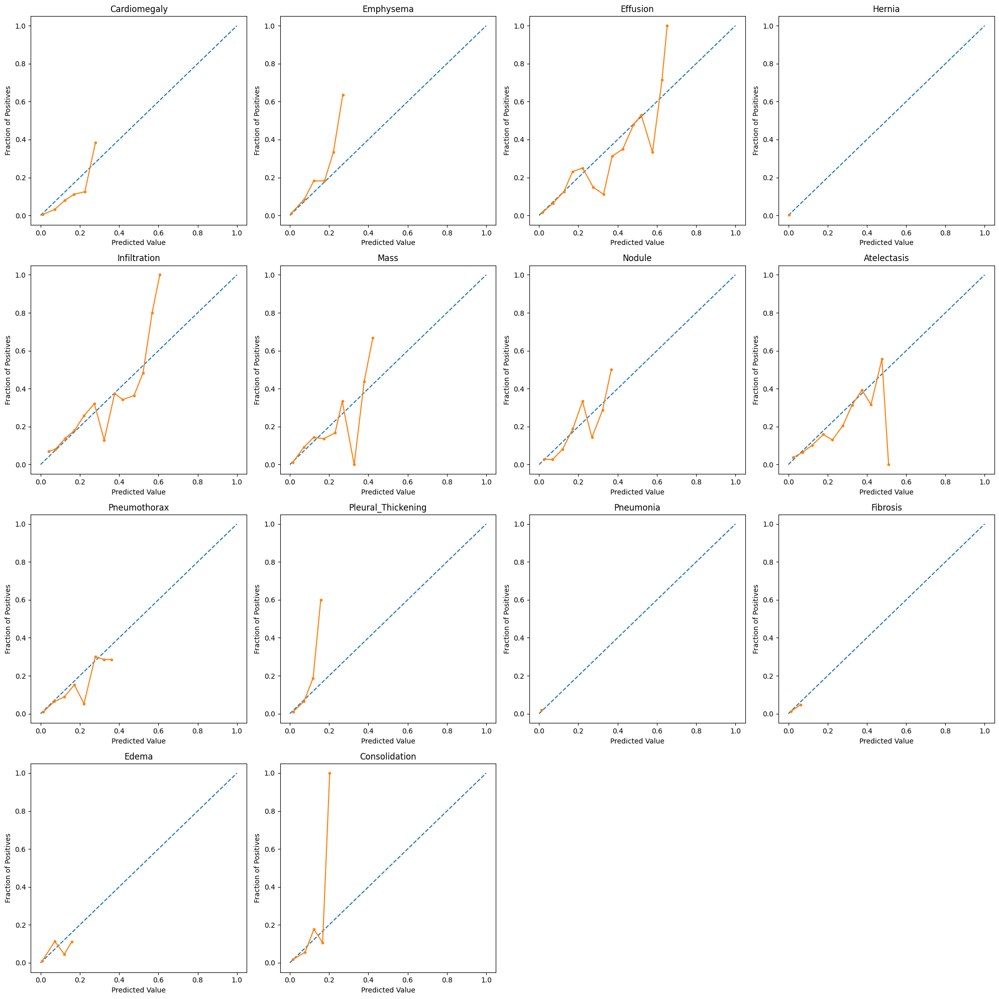
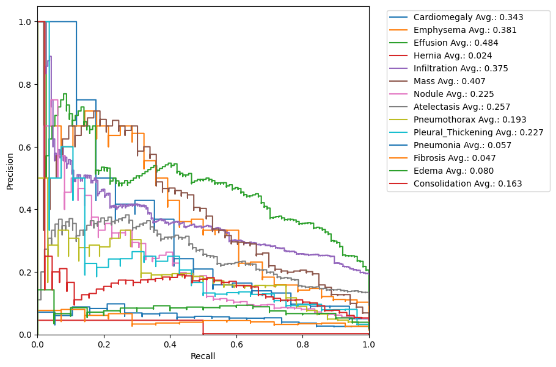

# Chest-X-ray-Disease-Classification-using-Deep-Learning
Deep learning project for multi-label chest X-ray disease classification using DenseNet and Grad-CAM visualization.

This project explores the use of deep learning for multi-label classification of chest X-ray images.  
A pretrained DenseNet model is used to predict multiple thoracic diseases from X-ray images.

The project also includes model evaluation using ROC-AUC and visualization of important image regions using Grad-CAM.

---

## Features

- Chest X-ray disease classification
- Multi-label prediction using DenseNet
- Model evaluation using ROC-AUC curves
- Grad-CAM visualization for model interpretability
- Data leakage detection between training, validation, and test sets

---

## Technologies

Python  
TensorFlow / Keras  
NumPy  
Pandas  
Matplotlib  
Seaborn  
Scikit-learn  

---

## Project Structure

Chest-X-ray-Disease-Classification-using-Deep-Learning/

├── data/               # CSV files for train/validation/test splits and eval for avaluation CSV files 

├── notebooks/          # Main notebook or Python script for the project

├── src/                # Utility functions ( util is used for chest_xray_diagnosis.py   and utils is used for evaluation.py )

├── Results/            # Example output figures

├── requirements.txt    # Project dependencies

└── README.md           # Project documentation

---
## Dataset

This project uses a subset of the NIH Chest X-ray dataset.

The image files are not included in this repository due to size limitations.

You can download the dataset from:

https://www.kaggle.com/datasets/nih-chest-xrays/data

After downloading, place the images in:

data/images-small/

Expected structure:

data/
  train-small.csv
  valid-small.csv
  test.csv
  images-small/
      image1.png
      image2.png

---

## Pretrained Models

The pretrained model weights are **not included** in this repository due to file size limitations.

The pretrained weights used in the models are not publicly available.
You can either train the model from scratch or use any DenseNet pretrained weights.

---

## Installation

Install required libraries:

pip install -r requirements.txt

## Example Results

  

## Model Evaluation

After training the DenseNet-based model, predictions were evaluated using clinically relevant metrics commonly used in medical AI.

The following metrics were computed for each disease class:

- ROC-AUC (Area Under the Receiver Operating Characteristic Curve)
- Sensitivity (Recall)
- Specificity
- Positive Predictive Value (PPV)
- Negative Predictive Value (NPV)
- F1-score

These metrics help assess the diagnostic capability of the model in identifying chest diseases from X-ray images.

## Calibration Analysis

To analyze the reliability of the predicted probabilities, calibration curves were generated for each disease class.

Calibration curves compare predicted probabilities with the actual fraction of positive cases, allowing us to evaluate whether the model is overconfident or underconfident in its predictions.

Well-calibrated models are particularly important in clinical applications where probability estimates may influence medical decisions.

## Precision - Recall curve

## Note on CSV Files

This repository combines two related parts of a deep learning pipeline developed during the course project.

The CSV files used in the repository come from different stages of the workflow:

- `train_small.csv`, `valid_small.csv`, and `test.csv` contain metadata used for training and validation of the chest X-ray classification model.

- Prediction CSV files (e.g., `train_pred.csv`, `valid_pred.csv`) contain model output probabilities that are used for performance evaluation and analysis.

Since these files originate from different steps of the pipeline (training vs. evaluation), the datasets and structures are not identical. This separation helps keep the training data and the evaluation results clearly organized.

