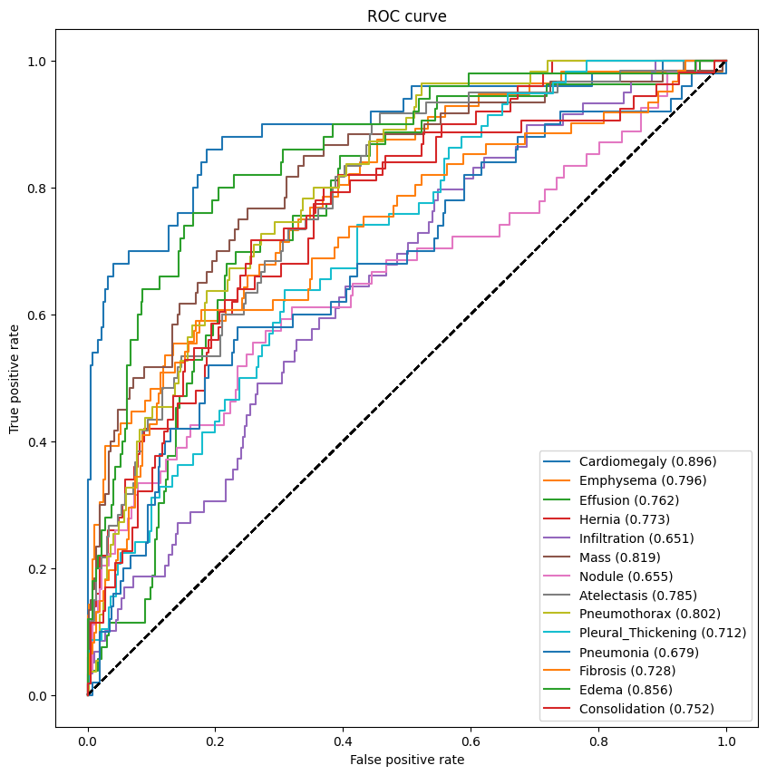
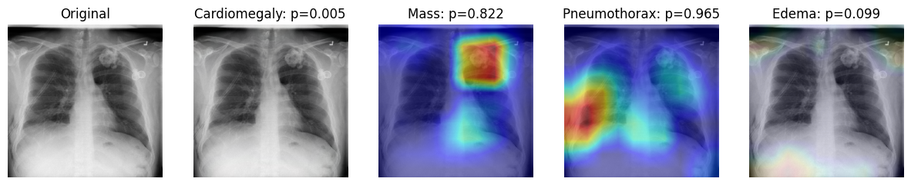
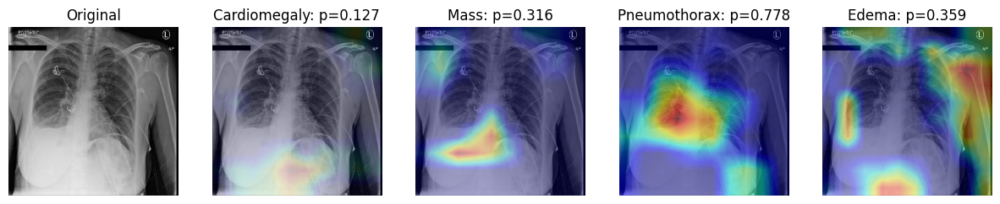
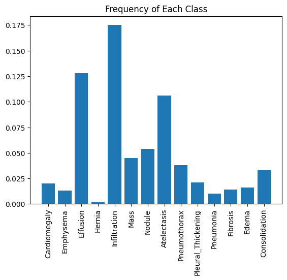

# Chest-X-ray-Disease-Classification-using-Deep-Learning
Deep learning project for multi-label chest X-ray disease classification using DenseNet and Grad-CAM visualization.

This project explores the use of deep learning for multi-label classification of chest X-ray images.  
A pretrained DenseNet model is used to predict multiple thoracic diseases from X-ray images.

The project also includes model evaluation using ROC-AUC and visualization of important image regions using Grad-CAM.

---

## Features

- Chest X-ray disease classification
- Multi-label prediction using DenseNet
- Model evaluation using ROC-AUC curves
- Grad-CAM visualization for model interpretability
- Data leakage detection between training, validation, and test sets

---

## Technologies

Python  
TensorFlow / Keras  
NumPy  
Pandas  
Matplotlib  
Seaborn  
Scikit-learn  

---

## Project Structure

Chest-X-ray-Disease-Classification-using-Deep-Learning/
├── data/               # CSV files for train/validation/test splits

├── notebooks/          # Main notebook or Python script for the project

├── src/                # Utility functions

├── Results/            # Example output figures

├── requirements.txt    # Project dependencies

└── README.md           # Project documentation

---
## Dataset

This project uses a subset of the NIH Chest X-ray dataset.

The image files are not included in this repository due to size limitations.

You can download the dataset from:

https://www.kaggle.com/datasets/nih-chest-xrays/data

After downloading, place the images in:

data/images-small/

Expected structure:

data/
  train-small.csv
  valid-small.csv
  test.csv
  images-small/
      image1.png
      image2.png

---

## Pretrained Models

The pretrained model weights are **not included** in this repository due to file size limitations.

The pretrained weights used in the models are not publicly available.
You can either train the model from scratch or use any DenseNet pretrained weights.

---

## Installation

Install required libraries:

pip install -r requirements.txt

## Example Results

  

